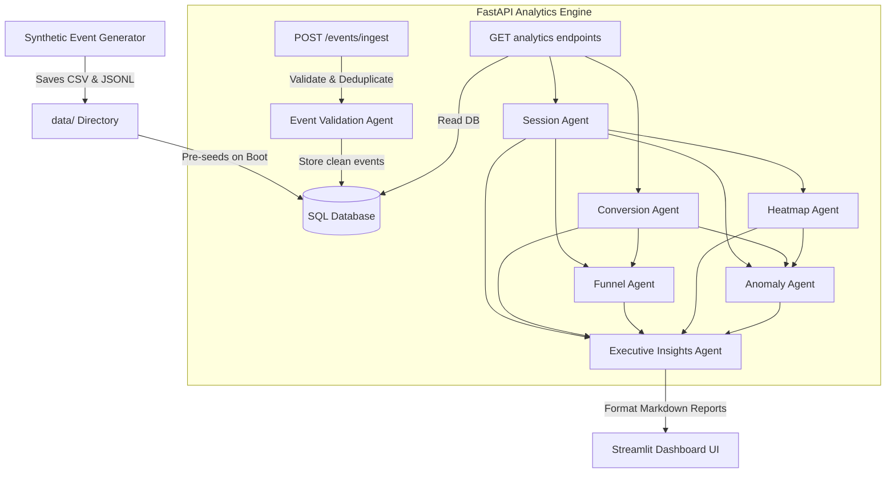

# Retail Store Intelligence Platform

An agent-driven retail analytics system that transforms CCTV-style behavioral events into actionable business intelligence.

Built as a production-ready solution for the **Purplle Engineering Hiring Challenge**.

---

## 📈 Architecture Flow


---

## ✨ Features
* **FastAPI Analytics Engine**: Extremely fast, asynchronous endpoints validating payloads with Pydantic type models.
* **Agent-Based Intelligence Pipeline**: 7 decoupled agents analyzing telemetry data, mapping session logic, checking queue bottlenecks, and building markdown executive insights.
* **Visitor Session Reconstruction**: Groups raw time-series camera ticks into logical visits, calculating session dwells and tracking zone pathways.
* **Conversion Funnel Analytics**: Measures traffic transition percentages and step-wise drop-offs.
* **Heatmap Generation**: Computes department foot traffic, average dwell times, normalized engagement scores, and low-confidence visual alerts.
* **Challenge Schema Integration**: Validates and stores machine learning camera telemetry including `gender_pred`, `age_pred`, `age_bucket`, `group_size`, `zone_name`, and `zone_type`.
* **Chronological Conversion Logic**: Links billing zone join events with POS checkouts using a strict 5-minute chronological window constraint.
* **Operational Anomaly Detection**: Proactively detects queue spikes, camera stale feeds, dead zones, and conversion drop-offs.
* **PostgreSQL / SQLite Support**: Fully adaptive connections, defaulting to a shared SQLite connection during tests and PostgreSQL in production.
* **Streamlit Dashboard**: Dark-mode frontend showcasing analytics tables, charts, active operational alerts, and an ingestion testing sandbox.
* **Dockerized Deployment**: Fully self-contained multi-container build configuration.

---

## 📊 Dataset Configuration
* **13,184 Synthetic Behavioral Events** (including Entries, Zone Enters, Dwells, Exits, Re-entries, and Queue logs).
* **357 POS Transactions** (ranging from ₹199 to ₹4999).
* **5 Retail Stores** (`STORE_BLR_001`, `STORE_BLR_002`, `STORE_DEL_001`, `STORE_MUM_001`, `STORE_HYD_001`).
* **1,000+ Unique Visitors** and **50+ Staff Members** (staff are excluded from visitor KPI aggregates).

---

## 🚀 Quick Start (Docker Compose)

If you have Docker installed, you can launch the entire system on your machine with a single command:

```bash
docker-compose up --build
```

This boots up:
1. **PostgreSQL Database** (listening on port `5432`).
2. **FastAPI Backend** (listening on port `8000`).
3. **Streamlit Dashboard** (listening on port `8501`).

* **OpenAPI Swagger Docs**: [http://localhost:8000/docs](http://localhost:8000/docs)
* **Streamlit Dashboard UI**: [http://localhost:8501](http://localhost:8501)

---

## 💻 Local Setup (Without Docker)

If you do not have Docker running, or prefer to run the project locally, you can use the built-in **SQLite** database mode. Follow these steps:

### Prerequisites
* **Python 3.8+** installed on your system.

### Step 1: Clone and Navigate to Project Directory
Navigate to the root folder of the project:
```bash
cd store-intelligence
```

### Step 2: Create a Virtual Environment
Create a clean Python virtual environment:
```bash
python -m venv .venv
```

### Step 3: Activate the Virtual Environment
Activate the environment based on your operating system:
* **macOS / Linux**:
  ```bash
  source .venv/bin/activate
  ```
* **Windows (PowerShell)**:
  ```powershell
  .venv\Scripts\Activate.ps1
  ```
* **Windows (Command Prompt / CMD)**:
  ```cmd
  .venv\Scripts\activate.bat
  ```

### Step 4: Install Dependencies
Install all required libraries (including the automatic database seeder requirements, `matplotlib` for pandas styling, and `httpx` for test execution):
```bash
pip install -r requirements.txt
```

### Step 5: Start the Backend API
Start the FastAPI server using Uvicorn. The backend will automatically create and seed the local SQLite database (`store_intelligence.db`) with synthetic data upon starting:
```bash
uvicorn app.main:app --host 0.0.0.0 --port 8000
```
* **Verify Backend**: Open [http://localhost:8000/docs](http://localhost:8000/docs) in your browser to view the interactive OpenAPI documentation.

### Step 6: Start the Streamlit Dashboard
In a **new terminal window** (with the virtual environment activated), start the Streamlit application:
```bash
streamlit run dashboard/streamlit_app.py --server.port 8501
```
* **Verify Dashboard**: Open [http://localhost:8501](http://localhost:8501) in your browser to interact with the visual dashboard panel.


---

## 🔌 API Curl Requests Reference

Test the APIs from your terminal using `curl`:

### 1. Ingest Events (`POST /events/ingest`)
```bash
curl -X POST "http://localhost:8000/events/ingest" \
     -H "Content-Type: application/json" \
     -d '[{
       "event_id": "9d90d8a0-f8fb-41a6-880c-26d03541c4ad",
       "store_id": "STORE_BLR_001",
       "camera_id": "CAM_ENTRY_01",
       "visitor_id": "VIS_1099",
       "event_type": "ENTRY",
       "timestamp": "2026-03-03T10:00:00Z",
       "dwell_ms": 0,
       "is_staff": false,
       "confidence": 0.95
     }]'
```

### 2. Get Store KPIs (`GET /stores/{id}/metrics`)
```bash
curl -X GET "http://localhost:8000/stores/STORE_BLR_001/metrics"
```

### 3. Get Conversion Funnel (`GET /stores/{id}/funnel`)
```bash
curl -X GET "http://localhost:8000/stores/STORE_BLR_001/funnel"
```

### 4. Get Heatmap (`GET /stores/{id}/heatmap`)
```bash
curl -X GET "http://localhost:8000/stores/STORE_BLR_001/heatmap"
```

### 5. Get Anomalies (`GET /stores/{id}/anomalies`)
```bash
curl -X GET "http://localhost:8000/stores/STORE_BLR_001/anomalies"
```

### 6. Get Executive Insights (`GET /stores/{id}/executive-insights`)
```bash
curl -X GET "http://localhost:8000/stores/STORE_BLR_001/executive-insights"
```

### 7. Get System Health (`GET /health`)
```bash
curl -X GET "http://localhost:8000/health"
```

---

## 🧪 Running Unit Tests
The test suite compiles in-memory without side effects.
```bash
pip install -r requirements.txt
pytest --cov=app --cov=agents tests/ -v
```

---

## 📁 Project Directory Layout
```
store-intelligence/
├── data/
│   ├── events.jsonl             # Simulated event records
│   ├── pos_transactions.csv     # POS sale transactions
│   └── store_layout.json        # Zone mapping settings
├── app/
│   ├── main.py                  # API routes & Seeder
│   ├── models.py                # SQL Alchemy model schema
│   ├── ingestion.py             # Event Pydantic validator
│   ├── metrics.py               # KPIs helper module
│   ├── funnel.py                # Funnel logic helper
│   ├── heatmap.py               # Heatmap logic helper
│   ├── anomalies.py             # Active anomaly sync
│   └── health.py                # Camera staleness validator
├── agents/
│   ├── event_validation_agent.py# Schema validation agent
│   ├── session_agent.py         # Visitor path session agent
│   ├── conversion_agent.py      # Receipts matching agent
│   ├── funnel_agent.py          # Stage dropout agent
│   ├── heatmap_agent.py         # Foot traffic engagement agent
│   ├── anomaly_agent.py         # Operations alert agent
│   └── executive_insights_agent.py # Executive reporting agent
├── database/
│   ├── db.py                    # Connection engine
│   └── schema.sql               # Reference SQL layout
├── dashboard/
│   ├── streamlit_app.py         # Streamlit UI
│   └── purplle_logo.png         # Brand custom logo asset
├── tests/
│   ├── test_metrics.py          # KPIs & re-entry tests
│   ├── test_funnel.py           # Funnel drop-off tests
│   ├── test_anomalies.py        # Spikes & stale alerts tests
│   ├── test_agents.py           # Direct agent unit tests
│   └── test_api.py              # FastAPI integration tests
├── docs/
│   ├── DESIGN.md                # System documentation
│   └── CHOICES.md               # Rationale documentation
├── docker-compose.yml           # Deployment layout
├── Dockerfile                   # Python container layout
├── requirements.txt             # Project library file
└── README.md                    # Project manual
```
